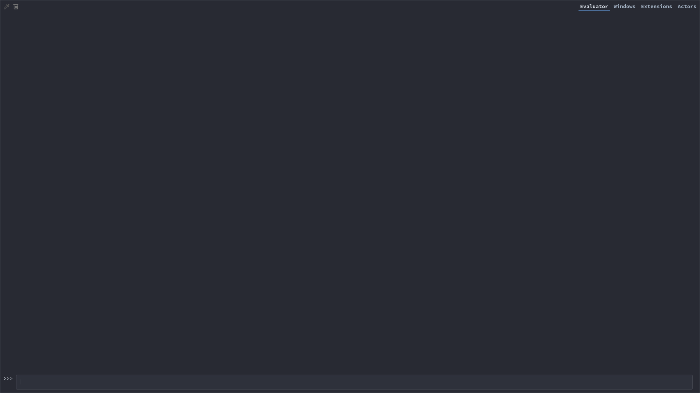
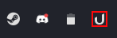
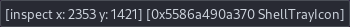
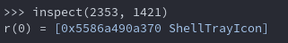

# How To blacklist apps

Open "Tray Icons: Reloaded" settings and click on the "Blacklist" foldout. Type in the name of the application. You can enter multiple names by seperating them with a comma. For changes to take affect you need to disable and re enable "Tray Icons: Reloaded". Sometimes the icon name is not the same as the apps name than you need to enter the icon name in the textbox. To find the icons name keep reading otherwise you can stop here.

### How to find the apps icon title

---

First you need to open "Looking Glass". To open looking glass press Alt+F2 on you keyboard and enter "lg". After pressing enter a window will appear simular to the one shown below.

On the top left corner you will see an eye dropper symbol. Click on it and hover over the icon you want to inspect. A red square will apear around the icon.

Befor you left click on the item make sure the right element is selected. The small pop up you see in the middle of your screen needs to say "ShellTrayIcon" on the end.

Now click on the icon. The looking glass window will reapear and a new entry will be addad.

In the input field on the bottom of the window type: `r(0).title`. Note the number behind "r" could be different. Make sure it is the same as the last entry. Press enter and the icon title will be displayed. 

