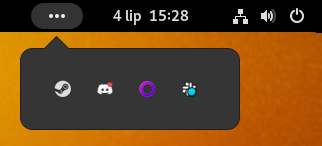
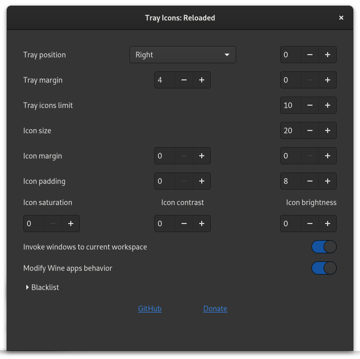

# Tray Icons Reloaded

Tray Icons Reloaded is a [GNOME Shell](https://www.gnome.org/) extension which bring back Tray Icons to top panel, with additional features.

## Compatibility

- It's only works with [Xorg](https://wiki.archlinux.org/index.php/GDM#Use_Xorg_backend) and XWayland.
- Appindicator and similar extensions are not compatible, disable it (some distributions ship it by default ex. Ubuntu based).
- If you have some trouble with compatibility you can try [snixembed](https://git.sr.ht/~steef/snixembed) it also adds visual native menus.
- Master always targeting current GNOME stable release.

## Wayland

If you are on Wayland and app won't run through XWayland you can force it via command:
`GDK_BACKEND=x11 app_name`

## Features

### Overflow mode

(default when there more than 3 items in tray)

### Rich settings

- fix left click invoking menu in some apps ex. Steam
- fast app killing (SHIFT + mouse middle click)
- window are invoked to current workspace (by default)
- work with Wine (left and middle click affect all wine apps)
- hide selected apps in your tray

## Installation

Grab it from [extensions.gnome.org](https://extensions.gnome.org/extension/2890/tray-icons-reloaded/) or unzip release to: ~/.local/share/gnome-shell/extensions.

## Credits

Evolved from: [unite-shell (hardpixel)](https://github.com/hardpixel/unite-shell) ([TopIcons Plus (phocean)](https://github.com/phocean/TopIcons-plus), TopIcons (Adel Gadllah), [TopTray (mjnaderi)](https://github.com/mjnaderi/TopTray))

## Buy me a beer 🍺

[https://revolut.me/martinpl](https://revolut.me/martinpl)
